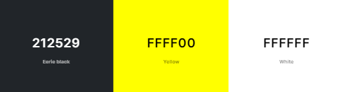

# Mileston 1 Project - Anthony Jones Handyman
###### By Gareth Llewelyn

[View website on GitHub Pages](https://llewbach.github.io/aj-builder/)

## Table of contents

> 1. Overview
> 2. UX
>> 1. Strategy
>> 2. Scope
>> 3. Structure
>> 4. Skeleton
>> 5. Surface
> 3. Build Log
> 4. Features
> 5. Technologies Used
> 6. Testing
> 7. Deployment
> 8. Credits
> 9. Acknowledgements
> 10. Disclaimer

## Overview

[Back to top](#mileston-1-project---anthony-jones-handyman)

This website is for educational purposes only. I originally planned to make this site for a real builder, but due to poor responsiveness, I've made it for an imaginary handyman.

## UX

[Back to top](#mileston-1-project---anthony-jones-handyman)

### Strategy

[Back to top](#mileston-1-project---anthony-jones-handyman)

This website is for a builder/handyman, with the aim of functioning essentially as an extended business card.

Handyman's goals...
- wants to be found
- wants the platform to inspire sense of **trust** and reliability in potential clients
- wants a means of receiving quote requests. This could potentially save the handyman time driving to sites if potential clients can submit pictures along with a description

Buyer's goals...
- wants to find a good builder
- wants **assurance** as to handyman's quality and character
- wants a convenient means of contacting the handyman and of requesting quotes for jobs, with the possibility of fewer home visits if pictures can be sent as well

Target audience
- homeowners, the majority without subject expertise
- property managers, who will probably have a variety of tasks to do on a regular basis

Unique selling proposition
- Anthony Jones is an experienced builder who charges reasonable prices, as opposed to most other tradesmen whose prices still remain high after the demand of the COVID era

Considerations
- Unlike B2C interactions, which depend more on impulsive decision making on the part of customers, hiring a builder is more like a B2B consideration. This is because hiring a builder is more of a serious commitment, both financially and because one has to live with the result thereafter. For this reason, providing assurance is paramount.
- Unlike a B2B interaction however, most customers are not industry experts and don't fully understand the problem, the solution or best practice. It is well known that among builders there are many 'cowboys' and those who will try to overcharge as much as possible. For this reason, it is vital that the site instills a positive emotional response in potential customers that inspires trust.

Given that in today's age, business is advertised and found via websites, the creation of a website is fully justified to fulfil the requirements above, if not essential.

### Scope

[Back to top](#mileston-1-project---anthony-jones-handyman)

1) What the customer says they need - a builder
2) What the customer actually needs - a good value, trustworthy builder
3) What the customer doesn't know they need - a long term contact who can offer other home-improvements that may be more affordable than previously realised

#### User Stories

'As an old lady, I would like to be able to find a reputable builder that I can be sure will help me fix my problems. For me, integrity is important and I'd much prefer to get a sense of the person I'm dealing with before I have them in my home.'

'As a busy professional, I need a solid guy I can turn to when I'm trying to short my portfolio shares in the middle of a market dive and suddenly s*** hits the fan at home, or floor should I say when the toilet starts overflowing. It would save me time making a decision about quotes if I could submit pictures and get an instant quote instead of having to wait for him to find time to drive over.'

#### Acceptance Critiera

- Users can successfully view information on mobile devices and desktops with the most common screen dimensions.
- Users can navigate to every page from every page.
- Users can input information into the contact form and submit successfully.
- If users input information incorrectly into the contact form, they will not be able to submit and they will be notified of any errors. This will include giving user feedback such as required fields and syntax validation.

#### Information and features scope

This site will act as an extended business card and will include information about:

- Services offered
- Experience
- Character
- Contact details
- Job quote request form

As the handyman is based in South Wales, I wondered whether or not to make the site bilingual. However, as the client doesn't speak Welsh himself, I thought it would not offer sufficient benefit.

### Structure

[Back to top](#mileston-1-project---anthony-jones-handyman)

Information needs to convey what (services), who (experience and character), how (contact) and how much (quote request form). This order makes sense for our site's pages, as the customer needs to know that this site is firstly relevant, secondly desireable, then actionable.

Given that the customer getting in contact is the desired outcome, the contact information will always be visible in the footer, as will the 'Get Quote' call to action, one click away.

The information will be structured as follows:

#### Header 

1) Logo and name
2) Nav bar

#### Footer 

1) Phone and email
2) **Call to action** (Get Quote!)
3) Instagram
4) Checkatrade

#### Home page

1) Immediately understandable summary/hook.
2) Provided services (categories, examples, and pics)

#### About page

1) Background, history, experience
2) Ethos, customer care
3) Specialties
3) Testimonials

#### Contact

1) Get quote form (Job description, attach pics, customer details, submit button)
2) Contact details 
3) Map with base location

### Skeleton

[Back to top](#mileston-1-project---anthony-jones-handyman)

I drew up some wireframes (available to view in the assets folder) in order to help direct the building phase. Upon inspection, it will be apparent that the end result is quite different to these, but given that this is my first website, I added more features and made more changes as my knowledge and confidence developed.

[Header/footer wireframe](assets/wireframes/header-footer.png)

[Home wireframe 1](assets/wireframes/home-1.PNG)

[Home wireframe 2](assets/wireframes/home-2.PNG)

[Home wireframe 3](assets/wireframes/home-3.PNG)

[About wireframe 1](assets/wireframes/about-1.PNG)

[About wireframe 2](assets/wireframes/about-2.PNG)

[Contact wireframe](assets/wireframes/contact.PNG)

### Surface

[Back to top](#mileston-1-project---anthony-jones-handyman)

#### Logo

For the logo, I wanted something simple enough to be used as a favicon as well. To this end I put GPT-4 to the task, asking for a simple logo of a roof based on the letter 'A'. After a few goes I chose one I liked. 

I then compressed the image and put the logo through a logo to favicon converter.

https://favicon.io/favicon-converter/

I then added a border blur to the logo using box-shadow.

#### Colour Palette

I used Coolors.co to consider different colour palettes, but none were crowd-pleasers.

Probably due to my lack of familiarity with it, I liked Bootstrap's dark theme, so I decided to simply add 'yellow' as a 'highlight' colour. The yellow and black combination is also strongly associated with builders.

#### Font

Using Google Fonts, I chose 'Stick No Bills' for header text, due to it's somewhat 'industrial' aesthetic. I chose 'Open Sans' for body text due to its readability and aesthetic simplicity.

#### Fixed images

I really like the parallax scroll effect using fixed images. It makes the page feel more interactive even though the user is only scrolling, making the content more engaging.

#### About page sticky titles and title covers

The About page contains a fair amount of text and I wanted to add effects in order to make it as engaging as possible. Having initially dabbled with ScrollMagic, I wanted to incorporate some fade in/out effects for my sticky titles using only CSS. To this end I used absolutely positioned covers with an opacity gradient to cover the title until it stuck in position, then appeared from beneath the cover.

## Build Log

[Back to top](#mileston-1-project---anthony-jones-handyman)

Please see the [Build Log](build-log.md) for an insight into the build process.

## Features

[Back to top](#mileston-1-project---anthony-jones-handyman)

### Navbar

On the left of the navbar, I have the logo and company name, and the menu items on the right. The navbar is fixed to the top of every page for ease of navigation.

The structure of the navbar was taken from Bootstrap and the menu items collapse on smaller screens.

### Footer

The footer is also fixed to the bottom of every page except 'Contact' because everything on the footer is to be found on the Contact page. I fixed the footer so that the call to action and contact details are always visible, as this is the primary goal of the site.

On extra small screens, only the icons are to be seen and the call to action button text displays as 'Get Quote'. On small screens the call to action text becomes 'Get Free Quote' as more room is obtained. On medium screens, text appears next to the icons in a stacked format, and on extra large screens, the footer items horizontally align.

### Hero sections

Hero sections feature at the top of the 'Services' page (index.html) and 'About' page. For consistency, these both feature fixed background images and centered text above an overlay. 

### Services section

For this I used Bootstrap grid for responsive layouts. On small screens, each service items appears stacked, with alternating image/category button orders, with horizontal dividers. On medium screens, the service items become a 2 x 4 table with one vertical divider. On extra large screens, this becomes a 4 x 2 table with one horizontal divider.

The images use Bootstrap's .img-thumbnail which helped to size the images. Each category button is a dropdown menu of subcategories of the services offered.

### About page parallax sections

These were built with Bootstrap rows and columns. On small screens, these become vertically stacked, and on medium screens and above, these appear side by side. The images are fixed, and the text column features 'sticky' titles and covers that simulate a fade in/out effect. 

### Parallax '.spacer' rows

This refers to the horizontal bars that separate the sequential fixed parallax images in order to make a smoother transition between sections. This was especially true for the About page which has three fixed images one after the other, and each section has aesthetic effects of their own going on as well, in the form of 'sticky titles' and 'title covers' with opacity gradients. 

Originally these spacers were simple block colours, but I later had the idea to spice these up with transparent text and a fixed secondary background with a colour gradient that would simulate light passing through the transparent text as the .spacer moves up the page.

### Testimonial carousel

The structure for this was obtained from Bootstrap and modified for my use. By default the caption disappears on small screens, but given that the testimonials are the primary point of this feature, I enabled captions on every screen size. I also added a general overlay to the pictures then a smaller secondary overlay around the caption text to aid legibility. 

The default carousel transitions caused image flickering due to automatic resizing. This was deactivated using `transition: none !important;` in the CSS stylesheet.

### Contact form

This form was built using Bootstrap rows and columns for responsivity. On smaller screens, each field label and input appear vertially stacked. On medium screens these appear in two columns. On larger screens, these have a 4:8 width ratio, with the inputs requiring more input taking up more space.

The form requires all essential information except 'upload photos'. The form will validate input for correct syntax and informs the user of any errors. The user will not be able to submit an incorrectly filled form.

The form items are styled using Bootstrap classes and FontAwesome icons.

### Contact page 'info row'

This is a Bootstrap grid, featuring a Google Map iframe showing the base location of Anthony the Handyman in the first column. The next column features Anthony's contact details. The third column features a fun and friendly picture of a 'call me maybe' gesture, encouraging engagement and instilling a positive emotional response.

## Technologies Used

[Back to top](#mileston-1-project---anthony-jones-handyman)

- [Balsamiq](https://balsamiq.com/) was used to create the wireframes
- HTML5 and CSS3
- [VSC](https://code.visualstudio.com/) was my development environment
- Google Chrome Dev Tools helped elucidate building and debugging
- [Bootstrap](https://getbootstrap.com/) v5.3.2 frontend framework was used for elements such as the navbar, testimonial carousel, grid layouts and dark theme
- [GitHub](https://github.com/LlewBach/aj-builder) was used for my online repository
- [GitHub Pages](https://pages.github.com/) was used to deploy the site
- [GPT-4](https://openai.com/research/gpt-4)
  - Used to create the logo
  - Used to create images of 'Anthony'
  - Used for advice and discovering new options
  - Used for debugging and syntax checking
- [FontAwesome](https://fontawesome.com/) was used for all icons
- [Google Fonts](https://fonts.google.com/) was used for interesting fonts
- [Unsplash](https://unsplash.com/) was used to obtain all real images as they are free to use
- [Image Resizer.com](https://imageresizer.com/image-compressor) was used to compress images
- [Coolors.co](https://coolors.co/) was used to consider different colour palettes
- [The W3C Markup Validation Service](https://validator.w3.org/) was used to check HTML syntax
- [The W3C CSS Validation Service](https://jigsaw.w3.org/css-validator/) was used to check CSS syntax
- [WebAIM](https://wave.webaim.org/) was used to examine accessibility
- Chrome Dev Tools [Lighthouse](https://developer.chrome.com/docs/lighthouse/overview/) was used to test performance, accessibility, SEO and best practices
- YouTube
  - [Clip an image to text with CSS](https://www.youtube.com/watch?v=9Kr3T4Ndl-o)
  - [Bootstrap 5 Crash Course Tutorial #14 - Working with Forms](https://www.youtube.com/watch?v=dKVX22GR7zQ)

## Testing

[Back to top](#mileston-1-project---anthony-jones-handyman)

### Acceptance Critiera Testing

#### Test that users can navigate between every page.

1) Open website in the Chrome browser.
2) From the 'Services' (main) page, use the menu to navigate to the other pages, returning back to the 'Services' page before each attempt. 
3) Repeat this for the About and Contact pages.
4) From each page, click the logo text to be taken to the 'Services' (main) page.
5) From the Services and About pages, press the 'Get (Free) Quote" button in the footer to be taken to the Contact page.
6) On the footer of each page, test that the links to Instagram and Checkatrade open in a new tab and display the correct sites.
7) On the Contact page, test that the link to Instagram opens in a new tab and displays the correct site.
8) Using a mouse, test that each link turns yellow when hovering over it on every page.

Test result: Pass.

#### Test that users can successfully view information on mobile devices and desktops with the most popular screen dimensions.

This is my testing procedure:

<!-- Setup -->
1) Open website in the Chrome browser.
2) Right click and click inspect.
3) Click the toggle device toolbar.
4) From the device selector dropdown, choose 'Responsive'.
<!-- Testing Function -->
5) Set view to test-specific dimensions.
6) Navbar:
  - Check logo and text visible
  - Check menu is collapsed or expanded appropriately
  - Check menu opens and displays appropriately if collapsed
  - Check menu closes if opened
7) Footer:
  - Check that footer items appear symetrically and fit within the view
  - Check that the call to action button is visible and centered
8) Page spacer(s)
  - Check that the .spacer text falls on one line and doesn't wrap
  - Check that the text is legible while scrolling
  - If unable to scroll, check that entire text is readable
  - If able to scroll, does spacer move across the whole viewport
9) Services Hero
  - Check that hero image takes up full screen width without distortion
  - Check that text is centered, and legible
10) Services Section
  - Check that the service items align in a symetrical and ordered fashion
  - Check that the dropdown menus work and all sub-category items are visible
11) About Hero
  - Check that hero image takes up full screen width without distortion
  - Check that text is centered, and legible
12) About parallax section
  - Ensure image is visible between the navbar and footer
  - Ensure image is aligned well, either centrally or left aligned
  - Ensure sticky titles are initially invisible and become fully visible upon scrolling
  - Ensure paragraph text does not reappear after disappearing below sticky title
  - Ensure sticky title disappears completely at the end of every section
13) About page testimonial carousel
  - Ensure text is readable and centrally aligned
  - Ensure that cycle forward and backward buttons work properly
14) Contact form
  - Ensure title is visible and central
  - Ensure form fields are arranged in an organized way, either stacked in one or two columns
15) Contact page 'info row'
  - Ensure map, contact info and 'call me' images are visible and ordered, either vertically or horizontally

Now the screen dimensions to be tested need to be decided upon. I went to [statcounter.com](https://gs.statcounter.com/screen-resolution-stats) to find the most common screen resolutions. 

<u>Desktop</u>

| Resolution | Frequency | Test Result |
| :--------: | :-------: | :---------: |
| 1920x1080 | 23.2% | Pass |
| 1366x768 | 14.3% | Pass |
| 1536x864 | 10.6% | Pass |
| 1440x900 | 6.8% | Pass |
| 1280x720 | 5.8% | Pass |
| 2560x1440 | 3.0% | Pass |

<u>Tablet</u>

| Resolution | Frequency | Test Result |
| :---: | :---: | :---: |
| 768x1024 | 24.4% | Pass |
| 810x1080 | 10.23% | Pass |
| 1280x800 | 6.15% | Pass |
| 820x1180 | 5.65% | Pass |
| 601x962 | 3.6% | Pass |

<u>Mobile</u>

| Resolution | Frequency | Test Result |
| :---: | :---: | :---: |
| 360x800 | 11.0% | Pass |
| 390x844 | 7.8% | Pass |
| 393x873 | 5.5% | Pass |
| 414x896 | 5.0% | Pass |
| 412x915 | 4.8% | Pass |
| 360x780 | 3.9% | Pass |

My mentor uses a 4k screen so I accomodated this as well

- 3840x2160 - Pass

#### Users can input information into the contact form and submit successfully.

1) Navigate to the website's contact page
2) Enter correct information into the form and press submit
3) Given that this is a fictitious site, I'll not require that the submit button actually submits

Test result: Pass.

#### If users input information incorrectly into the contact form, they will not be able to submit and they will be notified of any errors. This will include required fields, syntax validation and user feedback.

1) Navigate to website's contact page
2) Press submit with an empty form. Ensure user is notified that the first required field is required
3) Enter correct text then press submit. Ensure user is notified that the second required field is required. Enter correct text. Repeat for all required input fields (all but 'add photos')
4) For the email field, enter a random string to ensure that the user is prompted to enter a valid email address

Test result: Pass.

### Automated Testing

#### Lighthouse 

Here are my initial scores from Lighthouse:

- index.html (mobile)
  - Performance: 50
  - Accessibility: 84
  - Best Practices: 100
  - SEO: 83

- index.html (desktop)
  - Performance 93
  - Accessibility: 84
  - Best Practices: 100
  - SEO: 80

- about.html (mobile)
  - Performance: 74
  - Accessibility: 91
  - Best Practices: 100
  - SEO: 92

- about.html (desktop)
  - Performance: 94
  - Accessibility: 91
  - Best Practices: 100
  - SEO: 90

- contact.html (mobile)
  - Performance: 97
  - Accessibility: 92
  - Best Practices: 95
  - SEO: 91

- contact.html (desktop)
  - Performance: 99
  - Accessibility: 92
  - Best Practices: 95
  - SEO: 89

The first thing that comes to mind is to compress the images on the index.html. I already downloaded the smallest image size from Unsplash, but they clearly need to be smaller, especially for the sake of the mobile site. 

Having compressed the images, Lighthouse performance for the index page on mobile has gone from 50 to 93, but for desktop it's dropped from 93 to 82...

I think now that I've deployed the page to GitHub Pages, I need to wait a bit longer before testing after a recent commit. I tried the same test later and performance came back 100.

I added alt-text to all the index.html images. I then added aria-labels to all div background images on the other pages, as well as role="img". I then filled in the alt text for the bootstrap carousel. This brought the accessibility score up to 94. Lighthouse is telling me I need to add link text to my footer icon links on small screens. This I did with aria-labels. On the advice of GPT-4 I also added `rel="noopener noreferrer"` to all external links.

Under SEO feedback I can see that I need to add a unique meta description to each page.

Ok, time to review Lighthouse scores

- index.html (mobile)
  - Performance: 94
  - Accessibility: 100
  - Best Practices: 100
  - SEO: 100

- index.html (desktop)
  - Performance 98
  - Accessibility: 100
  - Best Practices: 100
  - SEO: 100

- about.html (mobile)
  - Performance: 92
  - Accessibility: 98
  - Best Practices: 100
  - SEO: 100

- about.html (desktop)
  - Performance: 94
  - Accessibility: 98
  - Best Practices: 100
  - SEO: 100

- contact.html (mobile)
  - Performance: 94
  - Accessibility: 92
  - Best Practices: 95
  - SEO: 100

- contact.html (desktop)
  - Performance: 99
  - Accessibility: 93
  - Best Practices: 95
  - SEO: 100

Here are a few new points raised/noticed
- It's advising that I convert jpeg/png format images to WebP/AVIF
- I've realised that I probably still need to compress the carousel images
- I have h elements in non-sequential order
- I need an accessibility title on the Google Maps iframe
- I need to remove unused Bootstrap JS script tags on the contact page which doesn't require it.

Well, although converting the images to WebP definitely reduced their sizes, for some reason my lighthouse performance thereafter absolutely tanked. I put this to my mentor who told me I should avoid WebP for now as it's not supported by some versions of Safari. Thankfully, all my old images were still in the Recycling Bin! 

I had indeed neglected to compress the carousel images, which I've now done.

I changed the non-sequential h titles and replaced them with p elements whose classes I targeted to adjust font size.

I added a title to the map iframe.

I'm not going to mess around with removing bootstrap tags.

Time for the last test (hopefully!)

- index.html (mobile)
  - Performance: 93
  - Accessibility: 100
  - Best Practices: 100
  - SEO: 100

- index.html (desktop)
  - Performance 93
  - Accessibility: 100
  - Best Practices: 100
  - SEO: 100

- about.html (mobile)
  - Performance: 86
  - Accessibility: 100
  - Best Practices: 100
  - SEO: 100

- about.html (desktop)
  - Performance: 95
  - Accessibility: 100
  - Best Practices: 100
  - SEO: 100

- contact.html (mobile)
  - Performance: 91
  - Accessibility: 100
  - Best Practices: 95
  - SEO: 92

- contact.html (desktop)
  - Performance: 99
  - Accessibility: 100
  - Best Practices: 95
  - SEO: 100

Mixed results with many scores actually coming down, but "tha'll do Donkeh, tha'll do'! 

#### WAVE

I've had a look on WAVE (Web Accessibility Evaluation Tool) and the only issue that catches my eye is that is says low colour contrast, but I don't think the software can take overlays into account.

#### HTML Validator

https://validator.w3.org/

The index and about pages passed straight away, but the contact page got caught out.

- I'd given the form textarea a type="textarea", probably in an effort to be accessible, but I don't remember clearly why I added that
  - Solution: delete attribute
- The sections don't have their own headers
  - Solution: remove section element from around the form, replace .info-row section with a div
- "Bad value 100% for attribute width on element iframe: Expected a digit but saw % instead"
  - Solution: specify width and height with CSS instead
- "Bad value 100% for attribute height on element iframe: Expected a digit but saw % instead.
  - Solution: specify width and height with CSS instead
- Typo: hp instead of p element
  - Solution: delete 'h'
- Other fallout from the 'hp' mistake above

HTML Validator appeased!

#### CSS Validator

https://jigsaw.w3.org/css-validator/

Thankfully passed first time. Two warnings though..

- "The value text is deprecated"
- "-webkit-background-clip is a vendor extension"

GPT-4 advises to set a fallback, such as to make the text transparent, which is already the case for me, so I'm happy to move on.

## Deployment

[Back to top](#mileston-1-project---anthony-jones-handyman)

### GitHub Pages

This site was deployed to GitHub Pages following the steps below:
1) Log into GitHub.
2) Select the [LlewBach/aj-builder](https://github.com/LlewBach/aj-builder) repository.
3) Click on the "Settings" tab.
4) Scroll down to the 'Pages' section.
5) Ensure 'Source' is set to 'Deploy from a branch'.
6) Ensure the branch chosen is 'Main', from its '/(root)'.
7) Click 'Save'.
8) Refresh the page and at the top there will appear the link to the website. This link may take a few minutes to appear. Here is the link (https://llewbach.github.io/aj-builder/).

### How to run this project locally

1. Download the IDE of your choice as well as Git.
1. Visit the GitHub repository for [AJHandyman](https://github.com/LlewBach/aj-builder).
2. Click on "Code" and copy the HTTPS link.
3. Create the folder where you would like to save the repository.
4. In your terminal, navigate to the folder and then input 'git clone ', then paste the HTTPS link and press enter.
5. Open the folder in your IDE. Use the Live Server extension to view the HTML pages.

## Credits

[Back to top](#mileston-1-project---anthony-jones-handyman)

### Media 

- All real photographs were obtained from Unsplash. 
- All pictures of 'Anthony' and the logo were made by GPT-4.

### Code

## Acknowledgements

[Back to top](#mileston-1-project---anthony-jones-handyman)

- I'd like to thank Ben Kavanagh for his great support, advice and feedback

## Disclaimer

[Back to top](#mileston-1-project---anthony-jones-handyman)

The contents of this site are fictitious and for educational purposes only.