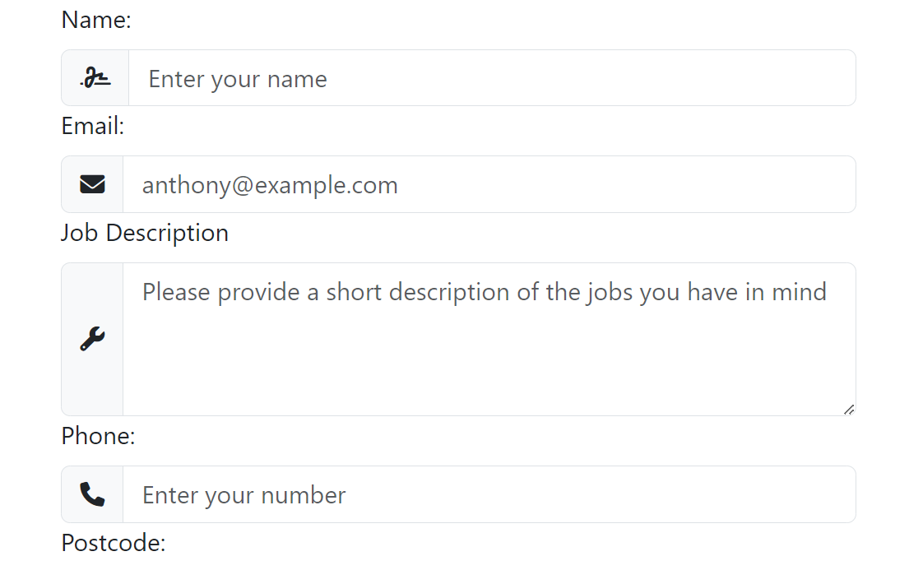

# Mileston 1 Project - Anthony Jones Handyman
###### By Gareth Llewelyn

[View website on GitHub Pages](https://llewbach.github.io/aj-builder/)

## Table of contents

> 1. [Overview](#overview)
> 2. [Strategy Plane](#strategy-plane)
> 3. [Scope Plane](#scope-plane)
> 4. [Structure Plane](#structure-plane)
> 5. [Skeleton Plane](#skeleton-plane)
> 6. [Building process and functional testing](#building-process-and-functional-testing)
>> 1. [Navbar and footer](#navbar-and-footer)
>> 2. [Hero](#holding-out-for-a-hero)
>> 3. [Services section](#services-section)
>> 4. [About page parallax sections](#about-page-parallax-sections)
>> 5. [About page testimonial section](#about-page-testimonial-section)
>> 6. [Contact page](#contact-page)
> 7. [Surface Plane](#surface-plane)
> 8. [Final testing](#final-testing)
> 9. [Deployment](#deployment)
> 10. [Credits](#credits)

## Overview

[Back to top](#mileston-1-project---anthony-jones-handyman)

This website is for educational purposes only. I originally planned to make this site for a real builder, but due to poor responsiveness, I've made it for an imaginary handyman.

In the first instance, I wrote this README chronologically including the whole build process. However, given the meandering nature of my learning process, trial and error, multiple revamps and occasional intervention from the Coding Gods, I have put matters relating to the same sections within the same chapters of the README out of compassion for any brave readers. A chronological sense of the development process can be more reliably obtained from the git pushes.

## Strategy Plane

[Back to top](#mileston-1-project---anthony-jones-handyman)

This website is for a builder/handyman, with the aim of functioning essentially as an extended business card.

Handyman's goals...
- wants to be found
- wants the platform to inspire sense of **trust** and reliability in potential clients
- wants a means of receiving quote requests. This could potentially save the handyman time driving to sites if potential clients can submit pictures along with a description

Buyer's goals...
- wants to find a good builder
- wants **assurance** as to handyman's quality and character
- wants a convenient means of contacting the handyman and of requesting quotes for jobs, with the possibility of fewer home visits if pictures can be sent as well

Target audience
- homeowners, the majority without subject expertise
- property managers, who will probably have a variety of tasks to do on a regular basis

Unique selling proposition
- Anthony Jones is an experienced builder who charges reasonable prices, as opposed to most other tradesmen whose prices still remain high after the demand of the COVID era

Considerations
- Unlike B2C interactions, which depend more on impulsive decision making on the part of customers, hiring a builder is more like a B2B consideration. This is because hiring a builder is more of a serious commitment, both financially and because one has to live with the result thereafter. For this reason, providing assurance is paramount.
- Unlike a B2B interaction however, most customers are not industry experts and don't fully understand the problem, the solution or best practice. It is well known that among builders there are many 'cowboys' and those who will try to overcharge as much as possible. For this reason, it is vital that the site instills a positive emotional response in potential customers that inspires trust.

Given that in today's age, business is advertised and found via websites, the creation of a website is fully justified to fulfil the requirements above, if not essential.

## Scope Plane

[Back to top](#mileston-1-project---anthony-jones-handyman)

1) What the customer says they need - a builder
2) What the customer actually needs - a good value, trustworthy builder
3) What the customer doesn't know they need - a long term contact who can offer other home-improvements that may be more affordable than previously realised

This site will act as an extended business card and will include information about

- Services offered
- Experience
- Character
- Contact details
- Job quote request form

As the handyman is based in South Wales, I wondered whether or not to make the site bilingual. However, as the client doesn't speak Welsh himself, I thought it would not offer sufficient benefit.

User stories

- Old granny needs help with a leaky tap. Finds clear, easy to use, reassuring website. The site's accessibility allowed her to contact the handyman.
- A home-owner who usually turns to DIY to save money needs help with a problem above his skill level, or a problem he has no time to deal with.

## Structure Plane

[Back to top](#mileston-1-project---anthony-jones-handyman)

Information needs to convey what (services), who (experience and character), how (contact) and how much (quote request form). This order makes sense for our site's pages, as the customer needs to know that this site is firstly relevant, secondly desireable, then actionable.

Given that the customer getting in contact is the desired outcome, the contact information will always be visible in the footer, as will the 'Get Quote' call to action, one click away.

The information will be structured as follows:

### Header 

1) Logo and name
2) Nav bar

### Footer 

1) Phone and email
2) **Call to action** (Get Quote!)
3) Instagram
4) Checkatrade

### Home page

1) Immediately understandable summary/hook.
2) Provided services (categories, examples, and pics)

### About page

1) Background, history, experience
2) Ethos, customer care
3) Specialties
3) Testimonials

### Contact

1) Get quote form (Job description, attach pics, customer details, submit button)
2) Contact details 
3) Map with base location and operating radius

## Skeleton Plane

[Back to top](#mileston-1-project---anthony-jones-handyman)

I drew up some wireframes (available to view in the assets folder) in order to help direct the building phase. I decided to focus on building the structure of the site first before worrying about surface plane considerations. The reason is that this is my first solo site, and I'm not completely sure of what is possible for me to build, and that some trial and error will be involved. It would thus be more time efficient to focus on surface plane features after I have made a web structure to work with, that is within my capability.

In the next section, I will log the building process and the considerations and problems that arise, and then return to consider the surface plane and relevant aspects such as font, colours, and appearance in general.

With regards to the actual content of the site at this stage, I have to use some imagination as my client is rather unresponsive shall we say (contrary to the raving testimonials I shall later devise).

## Building process and functional testing

I did the majority of my testing as I built each element, so I have included much of the testing I conducted within this section, especially for responsiveness.

### Navbar and footer

[Back to top](#mileston-1-project---anthony-jones-handyman)

I knew that I wanted to use the bootstrap navbar, because of its collapse functionality. However, I wondered whether or not I should wrap it in a header tag for semantic reasons. I decided that the nav element does this sufficiently well.

I copied the bootstrap navbar and modified the content.

Following my mentor's advice (shout out to Ben Kavanagh!) I focused first on mobile design.

My first concern was centering the mobile menu items, for which I used CSS.

I had a problem vertically aligning the logo text and the menu items due to the differing text sizes I presume. I resorted to eye-balling it with my client's business card and adjusting with CSS margin-top.

The navbar and footer are fixed to top and bottom, so that everything is only one click away at all times.

#### Bootstrap classes vs CSS?

By this point, I was wondering how extensively I should use Bootstrap classes rather than CSS. After all, one of the main points of using a stylesheet is to make the HTML more readable. I've decided to make use of bootstrap classes for the sake of consistency with regards to structural considerations such as flexbox, grid, centering items etc and using CSS if I can reuse code for more refined or superficial purposes multiple times (eg, using CSS to set margin-right: 20px for all the menu items rather than .me-x for each one). I realise this is something I'll have to refine with experience.

#### Responsive layout

Initially, I thought I would vertically stack the footer items on small screens. However, I decided that this would be a pointless waste of screen real estate, because the contact details are only one click away anyway on the contact page. I therefore initially made all but the button .d-none at small screen sizes.

I had to rebuild my footer using bootstrap row and column classes because flexbox wasn't enough to keep the button central.

On md screens, I divided the footer into 3 columns at md-size, with the 2 items on each side stacked with .flex-column. For lg screens, I wanted the items next to each other. To this end, I used nested bootstrap rows and columns. Looking at the result, I appreciate why mobile-first design makes sense! It would be much harder to work backwards from lg screens.

In the spirit of DRY, I think I'm actually going to have to declare the string "I had a problem with alignment" as a variable due to how frequently I foresee its use...

`const ballAche = "I have/had a problem with alignment.";`

`console.log(ballAche);`


GPT-4 informed me that I'd forgotten to give the last div a class of .col-lg-6. I am so grateful that I am learning to code in the age of AI tools like this. The amount of time it has saved me debugging has been enormous. I have huge respect for all those who treaded this path without it, and made this possible for those behind them.

`console.log(ballAche);`

Even on the largest screen I have, the email icon would not fall inline. Using Chrome dev tools, I could see that the column proportions were not working for lg-sizes. The button column was huge and the four sub-columns were cramped. I adjusted the outer column proportions to 5:2:5, which fixed the issue.

`console.log(ballAche);`

Vertical alignment this time. By drawing borders around the divs, I eventually realised that I had to:
- increase footer height with CSS 
- give the outer row the classes .h-100, and .align-items-center
- give each column the class .justify-content-center
- remove previous code attempting but failing to do this

`console.log(ballAche);`

According to Chrome dev tools, between roughly 992px and 1236px width, I was getting this...


With the dev tools, I could see that div padding was cramping the email. I removed this which resulted in the awkward range shrinking to 992-1120px. One temptation is to somehow redefine the lg breakpoint to skip this range. I will leave this problem for now however, as the content of the footer may change. (I did in fact do this later.)

I decided I wanted to have icons between xs-md. I initially tried to move the icons out of the paragraph with classes .d-none d-md-block so that they would always appear. I eventually realised I could put a span around the text and move the display classes from the paragraph to the span, leaving the icons visible. I had to change the display from 'block' to 'inline' however in order to keep the icons and text inline when displayed together. I also initially set the icons to disappear below sm by adding classes to the icon. This also required adding a .col-sm-6 to the containing divs in order for the icons to line up.

```html
<div class="row">
  <div class="col-sm-6 col-md-12 col-lg-6 text-center">
    <p>
      <i class="fa-solid fa-phone-volume d-none d-sm-inline"></i>
      <span class="d-none d-md-inline">
        07359637607
      </span>
    </p>
  </div>
  <div id="email-col" class="col-sm-6 col-md-12 col-lg-6 text-center">
    <p>
      <i class="fa-regular fa-envelope d-none d-sm-inline"></i>
      <span class="d-none d-md-inline">
        a.andrew.jones71@gmail.com
      </span>
    </p>
  </div>
</div>
```


I had previously tried to format the icons to appear in xs size, but I think the button text size was compressing other columns which made it hard. I then thought that if I made the button text responsive (dropping 'Free' at smaller sizes) that the icons would align better which turned out to be true.


I realised that dealing with the awkward range at the lg breakpoint would be easy if I changed the sub-column stacking from stacked to inline at the xl breakpoint instead of lg, only 3 changes.

I wanted to give the navbar and footer a dark theme so I could better see their outlines. I had to check the bootstrap docs to see that I needed a data-bs-theme attribute to apply this to the navbar. 

### Holding out for a hero

[Back to top](#mileston-1-project---anthony-jones-handyman)

I was unsure of how to use the header element (whether it should be used for the navbar), but I think it is ok to use for the hero section. (Future me: yes this makes good semantic sense).

Because my navbar and footer are fixed, I set a margin to the header to exactly match their heights. However, on the small width I've noticed that the bootstrap navbar height is responsive and narrows, leaving whitespace. To address this I will remove the background-image margin. Because my text was centered, getting rid of the margin has also centered the text relative to the viewport.

I looked at w3 schools to learn how to add the parallax effect, and only one line was required, background-attachment: fixed;

I then added an overlay beneath the text to make it more legible. 

This is also how I made the about page hero.

### Services section

[Back to top](#mileston-1-project---anthony-jones-handyman)

Having gained some confidence with bootstrap grid after the footer, I went back and made a mobile wireframe of this section. When I made my first item, the image overflowed from its container, so I went to Bootstrap docs, and under images I saw the option for the .img-thumbnail class, which conveniently sizes the images for me.

I downloaded the smallest version of each image from unsplash.com. In the future, I also compress every image using...

https://imageresizer.com/image-compressor

I used padding to reduce the thumbnail size. However, with dev tools, I realised that I could keep the image size and bring the items closer together by using .px-4 rather than .p-4.


I decided to turn the service titles into bootstrap dropdown buttons using the documentation.


My partner then strolled in and said this was a lot of whitespace and it wasn't clear which title belonged to what, so I decided to add dividers.

I asked GPT-4 for ideas on how I might do this and it suggested using an empty div and formatting the borders. At this stage, I'm hoping that I'll be able to manage this well as I modify the grid layout for larger screens.

The following day, my fears turned out to be justified! Trying to be clever, I wanted the service dividers to switch to vertical alignment at the md-breakpoint. I thought this would be easy by changing the col-md-x proportions and simply adding a media query and switching the width declaration for height as follows.


``` css
.service-divider {
  border-bottom: 2px solid #212529;
  width: 60%;
  margin: 10px auto;
}

@media only screen and (min-width: 768px) {
  .service-divider {
    border-left: 2px solid #212529;
    height: 60%;
    margin: 0 auto;
  }
}
```


I have no idea why it's behaving like this. I know that divs have different default widths and heights, but surely the horizontal dividers should at least not appear at all at the mid width range?

I managed to solve it by removing any reference to height whatsoever. 

``` css
@media only screen and (min-width: 768px) {
  .service-divider {
    border-left: 2px solid #212529;
    border-right: 2px solid #212529;
    width: 0px;
    margin: 0 auto;
    padding: 0;
  }
}
```


Even if I set the divider height to 100% it completely disappears. I am however content to move on!

`console.log(ballAche);`


Some of the pictures have different sizes. I don't know how bootstraps .img-thumbnail class works.

This was actually easy to solve. Using dev tools, I realised that all the images had equal widths, and sometimes varying height. I measured the most common height, then set a max-height at 1px greater.

As I'm working on the 4x2 layout for xl+ screens, I initially reactivated the fourth service div and limited the media query with a (max-width: 1200px) but I got this.


I've got a feeling that this is due to the max-width declaration on this div.

I had to write a separate media query for this, which fixed the issue. I also had to adjust the margin to suit the layout.

``` css
@media only screen and (min-width: 1200px) {
  .service-divider {
    width: 100%;
    margin: 0 auto 30px auto;
  }
}
```
I changed the width to 90% in order to better match the sm layout. And that's the home page done for now!

### About page parallax sections

[Back to top](#mileston-1-project---anthony-jones-handyman)

#### Stylesheet considerations

At this point I wondered how should I organise the stylesheet. I considered a separate stylesheet for the navbar and footer, one for the content of each page. But I thought that it's currently not that long and it would be easier to stylise the whole site if it were one document. (Future me: and having all the declarations in one place makes it much easier to look for conflicting rules when something doesn't behave as expected). I then separated the stylesheet with comments into its different components.

#### Two day ScrollMagic rabbit hole

I found a found a YouTube tutorial covering "Split Screen Parallax Effect Tutorial | HTML CSS & Javascript". 

https://www.youtube.com/watch?v=jvbL-VqACyM

However, having started to follow along and apply the principles to my site, I am wondering how I am going to make this responsive. I think I am going to use Bootstrap grid to set one column on small screens and two on md+. In the one column layout, the subsection title will pin to the top of the screen (hopefully) and in the two column layout, the subsection titles will pin to the side as per the tutorial.

With the tutorial above, I had trouble implementing ScrollMagic as I do not fully understand the automatic formatting it implements. I found another lesson YouTube series that is very good.

https://www.youtube.com/watch?v=qTzXNJeoHDw&list=PLugdEmbrdWSwKttz5Yfqt9jpNakpA_1Io&index=2

On my About page, I have now been able to pin an item for a fixed duration of scrolling. 


#### Coming back to sanity and simple CSS

At this point my progress was stalling. I asked my mentor if he was familiar with ScrollMagic as I was wondering if there were an industry standard for animated scrolling, perhaps with better, more recent tutorials online. He pointed out that JavaScript would not be marked for this project and that CSS would be sufficient for my needs. Upon further research I came across the Holy Grail

`position: sticky;`

Having experimented with it, I am in love with how much simpler it is.

My new plan is to have a very simple sticky effect, where the title of each section sticks to the top of the screen below the navbar. I will try to simulate text appearing and disappearing at the start and end by placing a cover with a high-z index at the top and bottom of each section.

#### Fixing images for parallax

With the fixed images, I had a fair amount of trouble with containing them. To get a parallax effect, I had to use CSS background properties rather than an image element. I then found out that the background-attachment: fixed; declaration positions and sizes the background image relative to the viewport, not the container. To get around this I set...

```css
.image-col {
  padding: 0;
  background-repeat: no-repeat;
  background-position: 10% center;
  background-size: auto 70%;
  background-attachment: fixed;
}

#image-1 {
  background-image: url(../images/about/about-fake-1.png);
}
```

However, because these values are relative to the viewport, not the container, it is hard to perfect positioning on all screen sizes, as all the other elements behave relative to their containers.

#### Simulating fade in and out with sticky titles

My next challenge is to replicate fading in and out of the .sticky-title elements. First I want to set the titles so that they start their 'fix' at the right time so that they can pop out from under their cover, have space to appear before paragraphs. This is how it currently looks...


After some tinkering, I ended up inserting a div (.title-cover) above the h2 element in the .text-col, and styling as follows...

```css
.text-col {
  padding: 0;
  position: relative;
}

.title-cover {
  position: absolute;
  left: 0;
  right: 0;
  top: 0;
  height: 65px;
  background-color: purple;
  z-index: 1;
}

.sticky-title {
  margin-bottom: 0;
  padding: 20px 0 10px 0;
  position: sticky;
  top: 70px;
  background-color: lightgoldenrodyellow
}

.text-col p:first-of-type {
  background-color: pink;
  margin-top: 120px;
}
```
Which turned out pretty dang good...


I had to leave a fair bit of padding at the top of the .sticky-title to help cover up the text passing underneath. I've noticed on the xs-screens, the bootstrap navbar shrinks from a height of 71 to 55px, which leaves a gap through which passing text appears. Since adding padding to the top of the title is problematic as it affects where it appears, another option is to add another cover but I'd rather not do this in order to minimise the number of components.


Given that the footer doesn't change height across different widths, I am going to set a min-height of 71px to the navbar in order to avoid text exposure and improve symmetry with the footer. 

For aesthetic consistency, I'm going to add a title cover to the bottom of the container so that the title disappears in the same way as it appears. Luckily this should involve duplication and minimal changes.

I would like to modify the title cover to have an opacity gradient to better simulate a smooth fade effect.

```css
background: linear-gradient(to bottom,
      rgba(255, 255, 255, 1) 0%,
      rgba(255, 255, 255, 1) 85%,
      rgba(255, 255, 255, 0) 100%);
```
I had to use only a small colour stop range for the fade effect as the height of the cover is quite small and I don't want to add too much scrolling distance to the page.


(Future me: I later manage to increase the padding size to extend the opacity gradient's 'zone').

#### Making fixed images work responsively

After some reflection, I think I need image wrappers to position the images properly.

The wrappers did not work at all.

Also, originally I had the image column disappear below md. I tried to reintroduce it to smaller screens by removing the .d-flex and d-md-block classes, but all hell broke loose. 

What followed next was two day odessey of pain trying to resolve a problem I still don't understand. I tried adjusting the stylesheet and html to an extent that I lost track of what I'd done and ended up making it worse. In the end I had to resort to 'git restore'. Having done this, the website actually seems better than I remember at the last git push, probably due to trauma. 

Anyway, what I'm now facing is a curious but at least functional situation. I've reinstated the first .image-col to appear on smaller screens. On the iPhone 12 simulator, I get this...


However, on a narrowed laptop screen, I get this...


No image to be seen.

Even though I'd given .sticky-row a minimum height of 100vh, this was not inherited by the columns. After I gave both .image-col and .text-col a height of 100vh, things improved. However, I noticed that the .text-col text was getting squeezed into the following row, probably due to the hard margin rules of the inner paragraph. I changed the .text-col declaration to 'min-height: 100vh' and the issue was resolved on all screens. (Note that here I didn't also immediately do this for the .image-col...big mistake).

I decided to center the fixed images by default and reposition the images to the left in the md media query. Because fixed images are positioned relative to the viewport, I had initially given the fixed images (.image-col) a background-position: 10% center; on md+ screens. I tried doing position: left then translatingX by 25%, but I realised that this was moving the whole column which was disastrous. I then settled back on background-position: 10% center;

But this did not resolve the issue ubiquitously. Below are the views of the page both on md screen sizes. The first on an iPad simulator, the second on my narrowed laptop screen.


I am tempted to simply change the column .col-md-6 classes to .col-lg-6. However, whereas on a phone you can scroll vh-100 in one thumb swipe, on an iPad you'd have to move your whole arm repeatedly which is not ideal. I've decided to set background-attachment: scroll; for the md to lg range. This allows the image to be sized and positioned nicely within the .image-col, and doesn't compromise useability on the iPad. (Future me: I later fix the image again and sort out the layout).

#### Adjusting .text-col elements

My next challenge is to fine tune the point at which the 'sticky titles' pop out from under their covers, the spacing between the sticky titles and the paragraph, and the paragraph text sizes on all screens. 

I realised that having changed the original Lorem ipsum text that was divided into three small paragraphs for one paragraph of 'real' text, the .justify-content-between was making the spacing weird. Given that the .text-col has an h2 and a p element, I would need a wrapper around the p element to center it without affecting the position of the h2.

Having wrapped the paragraphs and centered them, they look much better. But now the question is how to make the wrapper size reliably responsive so that the p text is always vertically centered.

The large and hard paragraph margin sizes are likely to be causing problems. However, having tried removing them, I remember their original purpose of keeping the paragraph out from under the title covers. I just need to bring them down to match the title cover height (~65px) more closely. I will bring them down to 80px for now.

This actually caused the p text to overflow, which meant there was a contraining issue. I realised that giving the .p-wrapper a min-height of 100% was a mistake. I now believe the proper height of the p-wrapper should be 100% - 2 * (percentage height of title cover).

Giving the title covers a % height rather than px has been tempting me for a while and the hour has now arrived.

I thought I could make the .text-col children completely responsive by giving them heights that would add up to 100%. Here is the html of the structure.


I tried giving the title-covers a height of 20% each and the .p-wrapper a height of 60% but this didn't work and I don't know why. The .text-col has a defined height of 100vh, and the sticky-title is no longer in the flow. 

I've just realised that the .title-cover divs are also removed from the document flow as they are positioned absolutely.

I will try wrapping the h2 title in a div, and give that a specific height%.

I've realised this wont work because now the title will only stick for the length of its div which is now very short. This is not an option.

Even though this is a bit messy, I might just get rid of the p-wrapper, and add in a small p afterwards, then make the .text-col a flexbox and set justify-contents-between. This will center the paragraph responsively. The small p will be hidden under the bottom title cover and I'll also set the colour to match the background. There must be a better way to do this but this will have to do.

Because I now have two paragraphs, one of which is 'sacrificial', I now have only a .text-col p:first-of-type selector. I have adopted the principle of setting the margin top and bottom for this to be slightly bigger than the title cover sizes. The specific sizes will have to be set for each screen with media queries, as their requirements are quite different. I have set the default for xs.

Ok, I have found a balance of factors that work well on xs:

- .title-cover height 20%
- opacity gradient stop now starts at 50% for better effect
- the main paragraph has margin top and bottom of 50%
- sticky title padding now 20% top and bottom
- sticky title top position of 5%

I'm now going to finetune the factors above for xl, because md is a really awkward range for me, as the views on the iPad simulator and my compressed laptop screen are completely different, even though they are both in the md range.

I luckily discovered that I can set the scroll duration to the fixed image to match the text length by adjusting the top and bottom padding of the .image-col! Absolute game-changer!

After fine tuning the factors for xl, I worked my way back down to md. Having improved my understanding of how the different factors interact on less troublesome larger screens, I went back to the xs size and finetuned the layout for each size from xs to xl. Below is an example of the factors I had to tune.

- Make the title covers big enough to give a nice fade in/out effect, but small enough that the p text didn't fall under them, leave a bit of room for titles to pop out and not take up too much vertical space.
- Make the p margins big enough to clear the text from the title covers on all screen 'modes', whilst not taking up too much vertical space.
- Make the sticky titles stick at a suitable height, and make sure that the padding was big enough to cover the text all they way to the top of the screen, and leaving a nice gap below the title to buffer it from the paragraph, but leaving a nice amount of room for text on all screen 'modes', and without being too big that the title padding would push them back out from under their covers.
- Add padding to the image so that the scroll length roughly matched the text scroll length. This was a matter of compromise to appear acceptable on different devices.

This is an example of the media query settings required.

```css
/* MD */

@media only screen and (min-width: 768px) {
  .image-col {
    background-position: 10% center;
    padding: 45% 0;
  }
  .title-cover-top {
    height: 22%;
  }
  .title-cover-bottom {
    height: 22%;
  }
  .sticky-title {
    padding: 12% 0 10% 0;
    top: 6%;
  }
  .text-col p:first-of-type {
    font-size: 1.2rem;
    margin: 40% auto;
  }
}
```
On the smaller simulators (iPhone and iPad), the percentage figures made very little difference to the layout, whereas on a compressed laptop screen they made a huge difference. This allowed me to make the layout work on both. This whole operation was a matter of compromise and optimisation, and on different screen dimensions, the layout is slightly different, but it works and looks ok.

#### Final .parallax-section image considerations

I am now very happy with the layout settings of the .parallax-section, save for one thing, the image positioning on the iPad screen (md range). Here are the three scenes currently...


To be clear, these are impossible to move, because on the compressed laptop view in the md range, they are completely visible and look fine. All attempts to reconcile these two views have completely failed. However, I've thought of a shameless easy fix. If you squint your eyes, you might agree that the first and third images actually still work in a 'kinda arty' way. For the second image to work similarly, all I need to do is get an image whose subject is mostly visible left of center!


Boom.

My mentor pointed out that there was an x overflow, which I had fixed by taking the spacers outside of row containers. I thought this was fixed but he pointed out that it was still happening on the mobile view. There's also an issue with the supposedly fixed navbar and footer scrolling a small amount with the page. I've got a feeling the x-overflow is due to the bootstrap container and grid. My mentor mentioned a potential gutter issue. 

I made the mistake of asking GPT-4 for quick advice on how to remove gutters, and the answer I got was to add the .no-gutters class to the rows. After seeing this not work, I went on for several hours trying a huge variety of different solutions. I later tried adding the class gx-0 to the rows after perusing Bootstrap docs and this finally worked! I went back to GPT-4 and asked if .no-gutters was still a current class, to which it replied 'no'. I always used to think that if GPT-4 had a physical body I would be in danger for asking so many dumb questions, but now the idea of it fills me with vengeful lust.

I've just noticed that this fix has solved the moving navbar and footer! Two in one. Ben called it fairplay.

### About page testimonial section

[Back to top](#mileston-1-project---anthony-jones-handyman)

#### Image sizing

For this I used the Bootstrap carousel component. Having never used this before, it involved a lot of trial and error to set it up to fit nicely and responsively between my navbar and footer. Bootstrap's carousel is set up to fill the viewport by default, but this was an issue because my navbar and footer are fixed. I experimented with different image sizes to find the smallest one that fulfilled my needs. I also had a problem with the images contracting and expanding in and out of view as the viewport width narrowed and widened. The reason I had difficulty with this was due to selecting the wrong targets. 

Here is the HTML hierarchy
```html
<section class="testimonial-section">
  <div id="carousel">
    <div class="carousel-inner">
      <div class="carousel-item">
        
```

```css
.testimonial-section {
  margin-bottom: 70px;
  background-color: lightcoral;
}

#carousel {}

#carousel .carousel-item {
  height: 82vh;
  transition: none !important;
}

#carousel .carousel-item img {
  height: 100%;
}
```
I initially tried to controll the carousel size by targeting .testimonial-section, then #carousel, but it only worked when I targeted #carousel .carousel-item. I assume this is because the image only responds to the height settings of its direct parent. However, only the upper part of the image was in view. When I targeted the image element within that div and set the height to 100%, the full image filled the available view space on all screen sizes.


After a short-lived feeling of relief, I encountered a new problem. On xs screen sizes, the images become squeezed width-wise. To fix this I added a media query.

```css
@media only screen and (max-width: 576px) {
  #carousel .carousel-item {
    height: auto;
  }
}
```

This works because at the xs breakpoint, the image width becomes the constraining factor. 

#### Carousel transitions

Another issue was with the transitions between images. I'm not sure why, but the images would transition at a larger size then snap back into the size set by me. I asked GPT-4 for advice and one of its suggestions was to add `transition: none !important;` as shown above.

#### Carousel captions

Below md sizes, the bootstrap carousel is set up to remove captions. However, because the point of this section is to provide testimonials, the caption text is actually the priority. I removed the .d-none and .d-md-block classes from the .carousel-caption divs. Then I realised that I need an overlay to make the text more legible. This I added but I then had to target the .carousel-caption divs and give them a z-index of 2 to bring them above the overlay with a z-index of 1.

#### Testimonial carousel revamp

The carousel is already in place but looks horrendous. I think because it is built to be full screen, I should enable this as much as possible. I've also realised that the whole point of this section is to give testimonials, not to be a gallery. This is how it currently looks on iPhone.


After the Vietnam that was the last section's epic struggle, handling the carousel images now feels much easier this time around. I replaced all previous sizing attemps with:

```css
#carousel .carousel-item img {
  min-height: 100vh;
  width: 100%;
  object-fit: cover;
}
```

This has made this section look much better on all screen sizes already. However, some factors will need tuning, such as text size, text location and width and height. When the screen is very wide, the image becomes too tall for example.

As per my mentor's recommendation, I added another overlay behind the text to make it more readable, and rounded the corners which looks cool.

I tried to vertically center the caption by making the .carousel-item a flexbox but that absolutely did <u>not</u> work.

Searching for an easy fix, I Googled 'how to vertically center a Bootstrap carousel caption?' and found exactly what I was looking for on Stack Overflow.

https://stackoverflow.com/questions/27279865/how-to-vertically-center-a-bootstrap-carousel-caption

```css
.carousel-caption {
  z-index: 2;
  /* The 3 lines below are from Stack Overflow */
  top: 50%;
  transform: translateY(-50%);
  bottom: initial;
}
```
The only further change was to increase font-size after md. I played around but couldn't make it look better by changing the width and height, so I'm leaving it there.

### Contact page

[Back to top](#mileston-1-project---anthony-jones-handyman)

#### Contact form

I watched this tutorial to get an idea of how to use bootstrap classes for forms.

https://www.youtube.com/watch?v=dKVX22GR7zQ

As per the tutorial, I used .form-label, .form-control, .input-group and .input-group-text classes for some nice styling effects.

This is what I have so far...


What I would really like is for the job description label and box line up with the name and email inputs, and for the 'Upload Photos' label and input to line up with the 'Phone:' ones. 

Having had a short break, I can see that the obvious answer is to split the form into two rows.


I've just realised that this will cause the form items to stack in the wrong order on small screens.



If I could switch the column order of the first row so that 'Job Description' and 'Name and Email' trade places, that will do. 

Achieved with bootstrap order classes.


#### Contact page info row

Below the 'form row' I created an 'info row' split into three. One with a map, one with a fun image, and the other with the handyman's contact details. The map I got from going to Google Maps, clicking 'share' then 'embed' which gave me an iframe link.

#### Contact page tune-up

As far as I can see, the only things that need attention are the middle text column and the fact that on the iPad, the content only comes down two thirds of the page.


My mentor quickly mentioned something about adding 'pipes' to the text column. I think I'm going to add dividers similar to those on the first page, to reinforce styling consistency and theme.

```css
.contact-divider {
  width: 80%;
  border-bottom: 4px solid #212529;
}
```

I also changed the .form-section margin-bottom to 15% which spaces the two sections a bit better on the iPad. I later changed it down to 10% because I didn't think it was worth the effect everywhere else just to satisfy the iPad.

I set the form to change to a 4:8 col ratio on lg+ screens to avoid the smaller input fields getting too long.

I later added the blinged up spacer to this page for brand consistency. 

When the info row columns are stacked in mobile view, I added margins to space them out which I reset to zero in the md media query. I also reinstated the 'call me maybe' image for small screens and had to resize it so the hand gesture was visible, then reset it to height: 80vh; in the md media query.

After a good while of tinkering, I finally cracked how to deal the different views of md widths on my laptop and on the ipad. I set a media query for only the md width range and a min-height of 1000px, which is just under the max height of the iPad (gleaned from testing). I had a huge amount of trouble sizing the .picture-col, but I found I had to change the min-height in the previous media query to 'height', and then I could change it within the iPad media query. This allowed me to fit everything on one page, by reducing the picture to a size in which the hand gesture can be seen, and reducing the spacer height. Given that the page no longer scrolled, I changed the background gradient of the spacer to be wider in order for the text to be readable while maintaining some gradient effect.


After I pushed to GitHub, I checked my GitHub Page on exactly the same view (iPad Pro, 1024 x 1366, 34% zoom), and looks unaffected...


I also noticed that there is more space between the navbar and the title on the first (local) version than the deployed version...

This was the moment that I disappeared down yet another rabbit hole of madness for two days trying to fix this inexplicable difference between the deployed and local views. Due to the intervention of the Coding Gods, it just so happened that I twigged shortly into my first tech support call with a tutor, thus ensuring maximal embarrassment. Basically, one browser tab view was zoomed in more than the other, and this affected the device pixel dimensions, even though its stated zoom didn't change. If that wasn't gutting enough, I then realized that this is what my mentor had meant in his immediate answer to this puzzle days earlier! Hard but educational.

In the light of this revalation, I had to make some changes to the attempted fixes I put through. In the end, I set one media query for the iPad Mini and Air, and one for the iPad Pro which is quite large. This was to avoid this media query covering too large a span and interfering with other queries and views.

`console.log(ballAche);`
In the final stages of responsiveness testing, I came across this problem while trying to make the contact form take up more screen space while maintaining alignment.


I think the answer to this will be to restructure the html. I turned the cols into flex boxes and wrapped each label and input in a div so they behave as units. The next phase was to figure out spacing, preferably in percentage in order to make the form take up the full screen. This is important for the spacer bar to move up and down well. I had to tune this for each media query. I then had a dilemma when testing responsiveness by compressing the monitor view. Each view is different when viewed on my laptop compared to my bigger monitor. I decided to prioritize the view for the larger monitor, as I guess a nice large monitor is probably what the assessor will test my site on, rather than a small, grimy laptop like me!

## Surface Plane

[Back to top](#mileston-1-project---anthony-jones-handyman)

Now I will work on the cosmetics of the website, such as colour palette, font pair, links and hover/focus states and accessibility.

### Buttons and Links

On the advice of GPT-4, I reformatted my footer button elements to an anchor element and styled it as a button. From the Bootstrap documentation, I gather that button elements are most often used to trigger JavaScripts. 

I formatted the footer button anchor to have a .btn-light class to contrast with the footer's dark theme.

I linked the footer labels for Instagram and Checkatrade to the corresponding sites, opening in new tabs. I also wrapped the icons within the anchor tags so that when these collapse to icons only on small screens, they are also links.

I was going to link the phone number and email address to the .info-section on the contact page in the same way, but after initially failing, GPT-4 told me that do link to another page you need to link to the page's URL with the id tagged on to the end. As my site doesn't have a domain yet, I'll leave this.

I set all a tags to have decoration: none;

### Icons, logo and favicon

At the request of my mentor I added icons to the menu items, as well as a logo and favicon. To do this I asked GPT-4 to make a logo with a roof based on the letter A, which eventually produced one I liked. I then compressed this image and included it in the bootstrap navbar. I then made a favicon out of this logo using a logo to favicon converter

https://favicon.io/favicon-converter/

I then added a border blur to the logo using box-shadow.

### Colour Palette

Although I like this bootstrap dark theme as it is, I need to decide on a complimentary colour palette. My first port of call is coolors.co, which I heard about from one of the CI webinars.

With a colour drop, I selected the Bootstrap dark theme colour and put it into coolors.co which then offers complimentary colour palettes. No doubt my partner would despair at yet another example of my deplorable lack of taste, but I settled on the following:

- #212529 Eerie black (Bootstrap dark theme)
- #FFC400 Mikado yellow
- #4381C1 Steel blue
- #5DFDCB Aquamarine

I have set the button:hover color to the mikado yellow and used the other colours elsewhere on the site.

(Future me: Due to later feedback as you'll see, I am changing this to:

- #212529 Eerie black (Bootstrap dark theme)
- rgb(255, 255, 0) (yellow)
- white)

### Font

I used Google Fonts for this. I decided on Roboto, then found a consensus online that Open Sans, which I happen to like, pairs well with Roboto. GPT-4 recommended I use Open Sans for titles, due to more open style, and Roboto for body as it is more condensed and readable in smaller sizes.

My mentor later said this was boring, so I went for 'Stick No Bills' and 'Open Sans' for the body.

### Adding some spice to the .spacer rows

I had my final meeting with my mentor today, and my key takeaway from his keen feedback was that my use of section colours was simultaneously 'boring' and even 'offensive'. This has made me resolve to spice things up!

I've had an idea to include the text Anthony Jones Handyman across the spacer, with transparent text over a second background with a gradient to create the effect of light shining through the letters as the spacer moves up the page.

I initially asked GPT-4 for tips, but even before I tried it, it didn't look right and was confused with a huge amount of unnecessary lines. However, it introduced me to the concept of background-clip: text. I then turned to YouTube and from searching for 'background-clip text' I found this tutorial

https://www.youtube.com/watch?v=9Kr3T4Ndl-o

This was much simpler and made sense to me, and taught me to apply a background directly to the p element and clip it to the text. I then fixed the background, and from my previous experience, I knew that this meant that the background was now relative to the viewport and would take up the full screen which is what I wanted for the effect to work. Next I had to set the gradient stops in such a way as to simulate light passing behind, while also making enough of the surrounding text visible for coherence.

```css
.spacer {
  height: 20vh;
  background-color: #212529;
}
.transparent-text {
  font-size: 2rem;
  background: linear-gradient(to top left, #212529 40%, yellow 50%, #212529 60%);
  color: transparent;
  background-attachment: fixed;
  background-clip: text;
  -webkit-background-clip: text;
}
```

This only worked after including the -webkit above.

I decided to add the spacers to every page, which also helps brand consistency. However, having set their font-size to 3rem, I noticed that the text was wrapping on small screens, meaning the effect was ruined. After setting it back to one, the text fits on one line but the letters are quite small. This text is decorative and it doesn't really matter if the effect is quite subtle. 

I actually adjusted this by reducing the text spacing and increasing the font size. Having looked at this on all devices, I can see that some media queries are in order.

My mentor pointed out that I was now getting a slight x-overflow on the about page. I fixed this by moving the .spacer divs out of the .container for the rows. This meant I had to create a separate section container for each row.


### .image-col tuneup

If you notice in the screenshot above, as my partner did rather brutally, there is effectively a white bar above the black spacer which looks sub-optimal. I am keen to try and displace this, although I am nervous I will have to 'tune' many other elements as a result!

After some tinkering, this was easily resolved by changing the .image-col 'height' declaration to 'min-height'. Very satisfying! I've just realised that I probably can get rid of all the padding I painstakingly specified for each media query...

Yes I can oh my god. Had I changed height to min-height earlier, I would have saved literally hours and hours of time, refining the padding to get it to better match the .text-col on all devices. Earlier satisfaction revoked!

## Final testing

[Back to top](#mileston-1-project---anthony-jones-handyman)

### Responsiveness

I documented most of the testing for responiveness in the [Building section](#building-process-and-functional-testing) above. I did however engage in a systematic examination of each page on every device on Chrome dev tools, as well as my own desktop screens. This is reflected in the media queries. 

### Tall screens

My mentor pointed out to me that on tall screens, the sticky title sticks out from below the opaque section of the title cover. To fix this I looked at the height range at which this starts to happen with Chrome Dev Tools and adjusted the 'top' declaration of the sticky title using a min-height media query, where I change the top value to 7% above a certain height.

### Lighthouse 

Here are my initial scores from Lighthouse:

- index.html (mobile)
  - Performance: 50
  - Accessibility: 84
  - Best Practices: 100
  - SEO: 83

- index.html (desktop)
  - Performance 93
  - Accessibility: 84
  - Best Practices: 100
  - SEO: 80

- about.html (mobile)
  - Performance: 74
  - Accessibility: 91
  - Best Practices: 100
  - SEO: 92

- about.html (desktop)
  - Performance: 94
  - Accessibility: 91
  - Best Practices: 100
  - SEO: 90

- contact.html (mobile)
  - Performance: 97
  - Accessibility: 92
  - Best Practices: 95
  - SEO: 91

- contact.html (desktop)
  - Performance: 99
  - Accessibility: 92
  - Best Practices: 95
  - SEO: 89

The first thing that comes to mind is to compress the images on the index.html. I already downloaded the smallest image size from Unsplash, but they clearly need to be smaller, especially for the sake of the mobile site. 

Having compressed the images, Lighthouse performance for the index page on mobile has gone from 50 to 93, but for desktop it's dropped from 93 to 82...

I think now that I've deployed the page to GitHub Pages, I need to wait a bit longer before testing after a recent commit. I tried the same test later and performance came back 100.

I added alt-text to all the index.html images. I then added aria-labels to all div background images on the other pages, as well as role="img". I then filled in the alt text for the bootstrap carousel. This brought the accessibility score up to 94. Lighthouse is telling me I need to add link text to my footer icon links on small screens. This I did with aria-labels. On the advice of GPT-4 I also added `rel="noopener noreferrer"` to all external links.

Under SEO feedback I can see that I need to add a unique meta description to each page.

Ok, time to review Lighthouse scores

- index.html (mobile)
  - Performance: 94
  - Accessibility: 100
  - Best Practices: 100
  - SEO: 100

- index.html (desktop)
  - Performance 98
  - Accessibility: 100
  - Best Practices: 100
  - SEO: 100

- about.html (mobile)
  - Performance: 92
  - Accessibility: 98
  - Best Practices: 100
  - SEO: 100

- about.html (desktop)
  - Performance: 94
  - Accessibility: 98
  - Best Practices: 100
  - SEO: 100

- contact.html (mobile)
  - Performance: 94
  - Accessibility: 92
  - Best Practices: 95
  - SEO: 100

- contact.html (desktop)
  - Performance: 99
  - Accessibility: 93
  - Best Practices: 95
  - SEO: 100

Here are a few new points raised/noticed
- It's advising that I convert jpeg/png format images to WebP/AVIF
- I've realised that I probably still need to compress the carousel images
- I have h elements in non-sequential order
- I need an accessibility title on the Google Maps iframe
- I need to remove unused Bootstrap JS script tags on the contact page which doesn't require it.

Well, although converting the images to WebP definitely reduced their sizes, for some reason my lighthouse performance thereafter absolutely tanked. I put this to my mentor who told me I should avoid WebP for now as it's not supported by some versions of Safari. Thankfully, all my old images were still in the Recycling Bin! 

I had indeed neglected to compress the carousel images, which I've now done.

I changed the non-sequential h titles and replaced them with p elements whose classes I targeted to adjust font size.

I added a title to the map iframe.

I'm not going to mess around with removing bootstrap tags.

Time for the last test (hopefully!)

- index.html (mobile)
  - Performance: 93
  - Accessibility: 100
  - Best Practices: 100
  - SEO: 100

- index.html (desktop)
  - Performance 93
  - Accessibility: 100
  - Best Practices: 100
  - SEO: 100

- about.html (mobile)
  - Performance: 86
  - Accessibility: 100
  - Best Practices: 100
  - SEO: 100

- about.html (desktop)
  - Performance: 95
  - Accessibility: 100
  - Best Practices: 100
  - SEO: 100

- contact.html (mobile)
  - Performance: 91
  - Accessibility: 100
  - Best Practices: 95
  - SEO: 92

- contact.html (desktop)
  - Performance: 99
  - Accessibility: 100
  - Best Practices: 95
  - SEO: 100

Mixed results with many scores actually coming down, but "tha'll do Donkeh, tha'll do'! 

### WAVE

I've had a look on WAVE (Web Accessibility Evaluation Tool) and the only issue that catches my eye is that is says low colour contrast, but I don't think the software can take overlays into account.

### Validators

#### HTML

https://validator.w3.org/

The index and about pages passed straight away, but the contact page got caught out.

- I'd given the form textarea a type="textarea", probably in an effort to be accessible, but I don't remember clearly why I added that
  - Solution: delete attribute
- The sections don't have their own headers
  - Solution: remove section element from around the form, replace .info-row section with a div
- "Bad value 100% for attribute width on element iframe: Expected a digit but saw % instead"
  - Solution: specify width and height with CSS instead
- "Bad value 100% for attribute height on element iframe: Expected a digit but saw % instead.
  - Solution: specify width and height with CSS instead
- Typo: hp instead of p element
  - Solution: delete 'h'
- Other fallout from the 'hp' mistake above

HTML Validator appeased!

#### CSS

https://jigsaw.w3.org/css-validator/

Thankfully passed first time. Two warnings though..

- "The value text is deprecated"
- "-webkit-background-clip is a vendor extension"

GPT-4 advises to set a fallback, such as to make the text transparent, which is already the case for me, so I'm happy to move on.

## Deployment

[Back to top](#mileston-1-project---anthony-jones-handyman)

### Web deployment

I deployed the site using GitHub Pages. Here is the link:

https://llewbach.github.io/aj-builder/

The site updates to include every new git push.

### How to run this project locally

1. Download the IDE of your choice as well as Git.
1. Visit the GitHub repository for [AJHandyman](https://github.com/LlewBach/aj-builder).
2. Click on "Code" and copy the HTTPS link.
3. Create the folder where you would like to save the repository.
4. In your terminal, navigate to the folder and then input 'git clone ', then paste the HTTPS link and press enter.
5. Open the folder in your IDE. Use the Live Server extension to view the HTML pages.

## Credits

[Back to top](#mileston-1-project---anthony-jones-handyman)

In building this project, I used GPT-4 extensively as a resource to look up things quickly, discover new tools and learn how to use them. I also used it to try to diagnose problems I came across. I also used GPT-4 to draw me images of 'Anthony' and the logo, as well as to write the testimonial text for the carousel. My use of GPT-4 is documented in the Building section.

StackOverflow provided me with a quick way of centering Bootstrap's carousel caption vertically. This is highlighted in the code and Building section.

I used the Bootstrap framework and documentation for advanced features such as the navbar, dropdown menus, carousel and contact form.

I used Unsplash for all real images as they are free to use. https://unsplash.com/

I would like to thank my mentor Ben Kavanagh for his sharp eye, great feedback and alleviation of my existential dread that web developers would soon be obsolete do to AGI. I also looked up to the README of his first project, [Hard Drivers](https://github.com/BAK2K3/hard-drivers) as a mark to aspire to.


