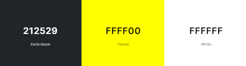

# Mileston 1 Project - Anthony Jones Handyman
###### By Gareth Llewelyn

[View website on GitHub Pages](https://llewbach.github.io/aj-builder/)

## Table of contents

> 1. Overview
> 2. UX
>> 1. Strategy
>> 2. Scope
>> 3. Structure
>> 4. Skeleton
>> 5. Surface
> 3. Features
> 4. Technologies Used
> 5. Testing
> 6. Deployment
> 7. Credits
> 8. Acknowledgements
> 9. Disclaimer

## Overview

[Back to top](#mileston-1-project---anthony-jones-handyman)

This website is for educational purposes only. I originally planned to make this site for a real builder, but due to poor responsiveness, I've made it for an imaginary handyman.

## UX

[Back to top](#mileston-1-project---anthony-jones-handyman)

### Strategy

[Back to top](#mileston-1-project---anthony-jones-handyman)

This website is for a builder/handyman, with the aim of functioning essentially as an extended business card.

Handyman's goals...
- wants to be found
- wants the platform to inspire sense of **trust** and reliability in potential clients
- wants a means of receiving quote requests. This could potentially save the handyman time driving to sites if potential clients can submit pictures along with a description

Buyer's goals...
- wants to find a good builder
- wants **assurance** as to handyman's quality and character
- wants a convenient means of contacting the handyman and of requesting quotes for jobs, with the possibility of fewer home visits if pictures can be sent as well

Target audience
- homeowners, the majority without subject expertise
- property managers, who will probably have a variety of tasks to do on a regular basis

Unique selling proposition
- Anthony Jones is an experienced builder who charges reasonable prices, as opposed to most other tradesmen whose prices still remain high after the demand of the COVID era

Considerations
- Unlike B2C interactions, which depend more on impulsive decision making on the part of customers, hiring a builder is more like a B2B consideration. This is because hiring a builder is more of a serious commitment, both financially and because one has to live with the result thereafter. For this reason, providing assurance is paramount.
- Unlike a B2B interaction however, most customers are not industry experts and don't fully understand the problem, the solution or best practice. It is well known that among builders there are many 'cowboys' and those who will try to overcharge as much as possible. For this reason, it is vital that the site instills a positive emotional response in potential customers that inspires trust.

Given that in today's age, business is advertised and found via websites, the creation of a website is fully justified to fulfil the requirements above, if not essential.

### Scope

[Back to top](#mileston-1-project---anthony-jones-handyman)

1) What the customer says they need - a builder
2) What the customer actually needs - a good value, trustworthy builder
3) What the customer doesn't know they need - a long term contact who can offer other home-improvements that may be more affordable than previously realised

#### User Stories

'As an old lady, I would like to be able to find a reputable builder that I can be sure will help me fix my problems. For me, integrity is important and I'd much prefer to get a sense of the person I'm dealing with before I have them in my home.'

'As a busy professional, I need a solid guy I can turn to when I'm trying to short all my stock in the middle of a market dive and suddenly s*** hits the fan at home, or floor should I say when the toilet starts overflowing. It would save me time making a decision about quotes if I could submit pictures and get an instant reply instead of having to wait for him to find time to drive over.'

#### Acceptance Critiera

- Users can successfully view information on all devices within the range 300px - 4000px width, 300px - 2200px height.
- Users can input information into the contact form and submit successfully.
- If users input information incorrectly into the contact form, they will not be able to submit and they will be notified of any errors. This will include required fields, syntax validation and user feedback.

#### Information and features scope

This site will act as an extended business card and will include information about

- Services offered
- Experience
- Character
- Contact details
- Job quote request form

As the handyman is based in South Wales, I wondered whether or not to make the site bilingual. However, as the client doesn't speak Welsh himself, I thought it would not offer sufficient benefit.

### Structure

[Back to top](#mileston-1-project---anthony-jones-handyman)

Information needs to convey what (services), who (experience and character), how (contact) and how much (quote request form). This order makes sense for our site's pages, as the customer needs to know that this site is firstly relevant, secondly desireable, then actionable.

Given that the customer getting in contact is the desired outcome, the contact information will always be visible in the footer, as will the 'Get Quote' call to action, one click away.

The information will be structured as follows:

#### Header 

1) Logo and name
2) Nav bar

#### Footer 

1) Phone and email
2) **Call to action** (Get Quote!)
3) Instagram
4) Checkatrade

#### Home page

1) Immediately understandable summary/hook.
2) Provided services (categories, examples, and pics)

#### About page

1) Background, history, experience
2) Ethos, customer care
3) Specialties
3) Testimonials

#### Contact

1) Get quote form (Job description, attach pics, customer details, submit button)
2) Contact details 
3) Map with base location

### Skeleton

[Back to top](#mileston-1-project---anthony-jones-handyman)

I drew up some wireframes (available to view in the assets folder) in order to help direct the building phase. Upon inspection, it will be apparent that the end result is quite different to these, but given that this is my first website, I added more features and made more changes as my knowledge and confidence developed.

[Header/footer wireframe](assets/wireframes/header-footer.png)

[Home wireframe 1](assets/wireframes/home-1.PNG)

[Home wireframe 2](assets/wireframes/home-2.PNG)

[Home wireframe 3](assets/wireframes/home-3.PNG)

[About wireframe 1](assets/wireframes/about-1.PNG)

[About wireframe 2](assets/wireframes/about-2.PNG)

[Contact wireframe](assets/wireframes/contact.PNG)

### Surface

[Back to top](#mileston-1-project---anthony-jones-handyman)

#### Logo

For the logo, I wanted something simple enough to be used as a favicon as well. To this end I put GPT-4 to the task, asking for a simple logo of a roof based on the letter 'A'. After a few goes I chose one I liked. 

I then compressed the image and put the logo through a logo to favicon converter.

https://favicon.io/favicon-converter/

I then added a border blur to the logo using box-shadow.

#### Colour Palette

Probably due to my lack of familiarity with it, I liked Bootstrap's dark theme, so I decided to simply add 'yellow' as a 'highlight' colour. The yellow and black combination is also strongly associated with builders.

#### Font

Using Google Fonts, I chose 'Stick No Bills' for header text, due to it's somewhat 'industrial' aesthetic. I chose 'Open Sans' for body text due to its readability and aesthetic simplicity.

#### Parallax '.spacer' rows

This refers to the horizontal bars that separate the sequential fixed parallax images in order to make a smoother transition between sections. This was especially true for the About page which has three fixed images one after the other, and each section has aesthetic effects of their own going on as well, in the form of 'sticky titles' and 'title covers' with opacity gradients. 

Originally these spacers were simple block colours, but I later had the idea to spice these up with transparent text and a fixed secondary background with a colour gradient that would simulate light passing through the transparent text as the .spacer moves up the page. 

## Features

[Back to top](#mileston-1-project---anthony-jones-handyman)

## Technologies Used

[Back to top](#mileston-1-project---anthony-jones-handyman)

- [Balsamiq](https://balsamiq.com/) was used to create the wireframes
- HTML5 and CSS3
- [VSC](https://code.visualstudio.com/) was my development environment
- Google Chrome Dev Tools helped elucidate building and debugging
- [Bootstrap](https://getbootstrap.com/) v5.3.2 frontend framework was used for elements such as the navbar, testimonial carousel, grid layouts and dark theme
- [GitHub](https://github.com/LlewBach/aj-builder) was used for my online repository
- [GitHub Pages](https://pages.github.com/) was used to deploy the site
- [GPT-4](https://openai.com/research/gpt-4)
  - Used to create the logo
  - Used to create images of 'Anthony'
  - Used for advice and discovering new options
  - Used for debugging and syntax checking
- [FontAwesome](https://fontawesome.com/) was used for all icons
- [Google Fonts](https://fonts.google.com/) was used for typography
- [Unsplash](https://unsplash.com/) was used to obtain all real images as they are free to use
- [Image Resizer.com](https://imageresizer.com/image-compressor) was used to compress images
- [Coolors.co](https://coolors.co/) was used to consider different colour palettes
- [The W3C Markup Validation Service](https://validator.w3.org/) was used to check HTML syntax
- [The W3C CSS Validation Service](https://jigsaw.w3.org/css-validator/) was used to check CSS syntax
- [WebAIM](https://wave.webaim.org/) was used to examine accessibility
- Chrome Dev Tools [Lighthouse](https://developer.chrome.com/docs/lighthouse/overview/) was used to test performance, accessibility, SEO and best practices

## Testing

[Back to top](#mileston-1-project---anthony-jones-handyman)

## Deployment

[Back to top](#mileston-1-project---anthony-jones-handyman)

## Credits

[Back to top](#mileston-1-project---anthony-jones-handyman)

## Acknowledgements

[Back to top](#mileston-1-project---anthony-jones-handyman)

## Disclaimer

[Back to top](#mileston-1-project---anthony-jones-handyman)